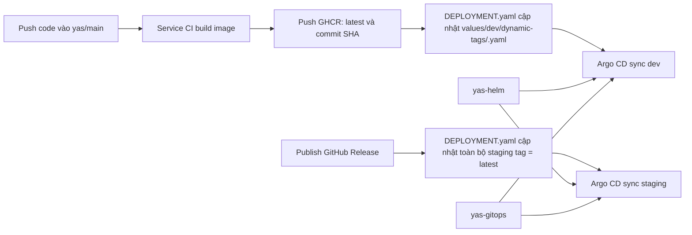

# YAS GitOps Runbook

Repo này là desired state cho hệ thống YAS trên cụm k3s. Ba repo được dùng trong flow là:

- `yas`: source code, GitHub Actions CI, build Docker image và push lên GHCR.
- `yas-helm`: Helm chart cho service, frontend, infrastructure và Keycloak.
- `yas-gitops`: Argo CD `Application`, value override theo môi trường, Istio policy.

Mục tiêu hiện tại: deploy 2 môi trường `dev` và `staging`, dùng chung infrastructure, chạy trên k3s qua Tailscale, image nằm ở GHCR account `23120049`.

## Trạng thái đã làm được

Phần đã có từ setup của bạn:

- Repo `yas` đã có workflow CI cho từng service, build image và push lên GHCR.
- Repo `yas-helm` đã có Helm chart cho service, UI, Swagger UI và infrastructure.
- Repo `yas-gitops` đã có cấu trúc GitOps cho Argo CD.
- Cụm target là k3s, truy cập qua IP Tailscale của node.

Phần đã được chỉnh thêm để flow chạy đúng dev/staging:

- Tách Argo CD application theo môi trường tại `applications/dev/services.yaml` và `applications/staging/services.yaml`.
- Dùng Argo CD multi-source để service chart lấy Helm chart từ `yas-helm` và value tag từ `yas-gitops`.
- Tạo per-service dynamic tag file trong `values/dev/dynamic-tags/` và `values/staging/dynamic-tags/`.
- Sửa workflow deploy trong `yas` để:
  - Push vào `main` cập nhật tag dev bằng `${{ github.sha }}` cho những service thay đổi.
  - Publish GitHub Release cập nhật toàn bộ tag staging thành `latest`.
- Sửa rollback/developer-test workflow để gọi script qua `bash`, tránh lỗi executable bit trên Windows.
- Sửa Keycloak chart trong `yas-helm` để redirect URI hỗ trợ `dev` và `staging`.
- Sửa GHCR owner trong Helm/workflow liên quan sang `23120049`.

## Cấu trúc repo

```text
yas-gitops/
├── applications/
│   ├── dev/
│   │   └── services.yaml
│   └── staging/
│       └── services.yaml
├── bootstrap/
│   └── root.yaml
├── infra/
│   ├── elasticsearch.yaml
│   ├── kafka.yaml
│   ├── keycloak.yaml
│   ├── observability.yaml
│   ├── pgadmin.yaml
│   ├── postgres-init.yaml
│   ├── postgresql.yaml
│   └── zookeeper.yaml
├── istio/
│   ├── dev/
│   └── staging/
└── values/
    ├── dev/
    │   └── dynamic-tags/
    ├── infra/
    └── staging/
        └── dynamic-tags/
```

## Cách flow hoạt động



Trích từ file `yas/.github/workflows/DEPLOYMENT.yaml`, dev dùng commit SHA:

```yaml
ENVIRONMENT: dev
IMAGE_TAG: ${{ github.sha }}
```

Trích từ file `yas/.github/workflows/DEPLOYMENT.yaml`, staging dùng `latest` khi tạo release:

```yaml
ENVIRONMENT: staging
IMAGE_TAG: latest
```

## Dev và staging

Hai môi trường dùng chung infrastructure trong namespace `infra`.

Hai môi trường tách application namespace:

- Dev: `dev`
- Staging: `staging`

Vì chạy song song hai môi trường trên cùng cluster, các public host phải tách nhau. Dev dùng `dev-*`, staging dùng `staging-*`. Infrastructure host như Keycloak, pgAdmin, Kibana, Grafana có thể dùng chung.

## DNS and ingress

Istio is the only external ingress. K3s ServiceLB must advertise
`istio-ingressgateway` on node D. Each teammate maps the `*.yas.local.com`
names in `hostnames.txt` to `100.124.113.25`, the IP advertised by the gateway
Service.

Use the Linux/WSL Tailscale IP when that environment directly runs k3s and
ServiceLB advertises it. Use the Windows Tailscale IP only when Windows owns
Tailscale and forwards ports 80/443 into the k3s environment. The authoritative
value is `.status.loadBalancer.ingress[0].ip` on `istio-ingressgateway`.

## One-command bootstrap

Điều kiện trước khi chạy:

- k3s cluster đã chạy.
- Máy local truy cập được cluster qua `kubectl`.
- Argo CD có quyền đọc repo `23120049/yas-gitops` và `23120049/yas-helm`.
- `istio-ingressgateway` được ServiceLB advertise trên node D.

Commit and push the `yas-gitops` and `yas-helm` state first, then run one command from a Bash shell:

```bash
./scripts/bootstrap.sh
```

This is the GitOps equivalent of the old YAS deployment scripts. Run it from
`main` after the deployment changes have been merged and pushed. Argo CD reads
remote `main`, so feature branches are review artifacts rather than deployment
sources. The command is idempotent and stops at the first unhealthy phase:

```text
prerequisites and Argo CD
  -> operators
  -> core infrastructure (PostgreSQL, Redis, Elasticsearch)
  -> PostgreSQL database initialization
  -> dependent platform (Kafka/Connect, Keycloak, pgAdmin)
  -> Debezium connectors
  -> shared dev/staging configuration
  -> dev/staging workloads
  -> Istio routing policies
```

The timeout for each gate defaults to 15 minutes. Override it with `BOOTSTRAP_TIMEOUT=30m`. When prerequisites are already installed, use `SKIP_PREREQUISITES=true ./scripts/bootstrap.sh`.

If GHCR packages are private, provide credentials to the same command; the
script creates pull secrets after namespaces exist and before workloads start:

```bash
GHCR_USERNAME=<user> GHCR_TOKEN=<read-packages-token> ./scripts/bootstrap.sh
```

Infrastructure gating checks both Argo CD health and runtime readiness.
PostgreSQL, Redis, Elasticsearch, and Kibana must report ready before
database initialization. Kafka and its Debezium connectors are intentionally
deployed afterward because they consume the newly-created product databases.
Keycloak, pgAdmin, and Kafka must then become ready before shared application
configuration and workloads are enabled.

Do not use `kubectl apply -f bootstrap/root.yaml` for a new deployment. That legacy manifest starts all roots concurrently and bypasses readiness gates.

If the legacy roots are already installed, migrate them in the same command:

```bash
MIGRATE_LEGACY_ROOTS=true ./scripts/bootstrap.sh
```

This deletes the old Argo CD parent and child `Application` objects with orphan propagation, preserving their Kubernetes workloads. The phased roots then adopt the desired state in order. Without this flag, bootstrap refuses to continue while a legacy root exists.

Sau bootstrap, kiểm tra:

```bash
kubectl get applications -n argocd
kubectl get ns
kubectl get pods -n dev
kubectl get pods -n staging
```

## Multi-source và image tag

Mỗi service app trong `applications/dev/services.yaml` và `applications/staging/services.yaml` lấy chart từ `yas-helm`, đồng thời lấy value file từ repo này.

Trích từ file `applications/dev/services.yaml`:

```yaml
sources:
  - repoURL: 'https://github.com/23120049/yas-helm.git'
    path: charts/cart
    helm:
      valueFiles:
        - $values/values/dev/dynamic-tags/cart.yaml
  - repoURL: 'https://github.com/23120049/yas-gitops.git'
    ref: values
```

Trích từ file `values/dev/dynamic-tags/cart.yaml`:

```yaml
backend:
  image:
    repository: ghcr.io/23120049/yas-cart
    tag: latest
```

Workflow trong `yas` sẽ cập nhật field `backend.image.tag` hoặc `ui.image.tag` trong file per-service này.

## GitHub Actions secrets

Trong repo `yas`, cần cấu hình:

- `GITOPS_TOKEN`: token có quyền push vào repo `23120049/yas-gitops`.
- `SONAR_TOKEN`: nếu vẫn chạy SonarCloud.
- `SNYK_TOKEN`: nếu vẫn chạy Snyk.

GitHub Actions mặc định dùng `GITHUB_TOKEN` để push image lên GHCR trong cùng account. Nếu package GHCR bị private, cluster cần pull secret tương ứng.

## Release flow cho staging

Ý tưởng staging hiện tại theo yêu cầu của bạn:

1. CI trên `main` build và push image với 2 tag: `latest` và `${{ github.sha }}`.
2. Khi bạn tạo GitHub Release trên UI, workflow deploy không dùng release tag làm Docker tag.
3. Workflow cập nhật toàn bộ staging image tag thành `latest`.
4. Argo CD sync staging và kéo image `latest` mới nhất.

Lưu ý: cách này dễ vận hành nhưng staging không immutable tuyệt đối vì `latest` có thể đổi nội dung. Nếu cần audit/reproduce chặt hơn, staging nên dùng release tag hoặc commit SHA.

## Developer test và rollback

Deploy test một service vào `dev`:

```text
GitHub Actions -> DEPLOYMENT-test.yaml -> Run workflow
```

Input cần chọn:

- `service`: tên service, ví dụ `cart`.
- `image_tag`: tag muốn test, ví dụ commit SHA.

Rollback dev:

```text
GitHub Actions -> ROLLBACK.yaml -> Run workflow
```

Script update tag nằm ở file `yas/.github/scripts/update-gitops-image-tag.sh`. Script rollback nằm ở file `yas/.github/scripts/rollback-gitops-image-tags.sh`.

## Keycloak redirect URI

Keycloak vẫn dùng chung infrastructure, nhưng redirect URI phải biết cả dev và staging host.

Trích từ file `yas-helm/deploy/keycloak/keycloak/values.yaml`:

```yaml
backofficeRedirectUrls:
  - http://dev-backoffice.yas.local.com
  - http://staging-backoffice.yas.local.com
storefrontRedirectUrls:
  - http://dev-storefront.yas.local.com
  - http://staging-storefront.yas.local.com
apiRedirectUrls:
  - http://dev-api.yas.local.com
  - http://staging-api.yas.local.com
```

## Istio

Istio được quản lý qua GitOps:

- `istio/dev`: policy cho namespace `dev`.
- `istio/staging`: policy cho namespace `staging`.

Bạn có thể dùng chung control plane Istio cho cả hai môi trường. Phần cần tách là namespace, workload selector, AuthorizationPolicy và VirtualService/DestinationRule theo service host nội bộ của từng namespace.

Kiểm tra nhanh:

```bash
kubectl get peerauthentication -A
kubectl get authorizationpolicy -A
kubectl get virtualservice -A
kubectl get destinationrule -A
```

## Thứ tự chạy đề xuất

1. Push toàn bộ thay đổi trong `yas-helm`, `yas-gitops`, `yas`.
2. Cấu hình secrets trong repo `yas`.
3. Đảm bảo GHCR package của `23120049` có thể pull từ cluster.
4. Cập nhật hosts file theo block ở trên.
5. Cài Argo CD vào k3s.
6. Add repo credentials cho `yas-gitops` và `yas-helm` trong Argo CD nếu repo private.
7. Chạy `./scripts/bootstrap.sh` trong repo `yas-gitops`.
8. Để script kiểm tra từng readiness gate; sửa phase bị lỗi rồi chạy lại cùng command.
9. Push một thay đổi nhỏ vào service trên `yas/main` để kiểm tra dev auto deploy.
10. Tạo GitHub Release trên repo `yas` để kiểm tra staging promotion.

## Kiểm tra sau khi deploy

```bash
kubectl get pods -n postgres
kubectl get pods -n keycloak
kubectl get pods -n dev
kubectl get pods -n staging
kubectl get ingress -A
```

Kiểm tra URL:

- `http://dev-storefront.yas.local.com`
- `http://dev-backoffice.yas.local.com`
- `http://dev-api.yas.local.com/swagger-ui`
- `http://staging-storefront.yas.local.com`
- `http://staging-backoffice.yas.local.com`
- `http://staging-api.yas.local.com/swagger-ui`
- `http://identity.yas.local.com`
- `http://kibana.yas.local.com`

## Ghi chú còn cần xác minh trên cluster

Các phần dưới đây không thể xác minh chỉ bằng file local, cần chạy trên cluster/GitHub:

- GitHub Actions có quyền push GHCR và push vào `yas-gitops`.
- Argo CD multi-source hoạt động với version Argo CD đang cài.
- Cluster có pull secret nếu GHCR package private.
- Ingress controller route đúng qua IP Tailscale.
- Istio CRD đã được cài trước khi sync `istio/dev` và `istio/staging`.
- Keycloak CRD đã được cài trước khi sync chart Keycloak.
